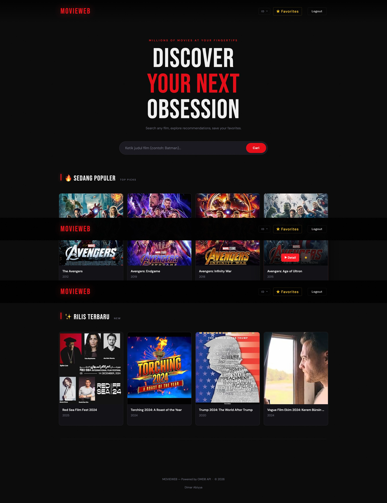
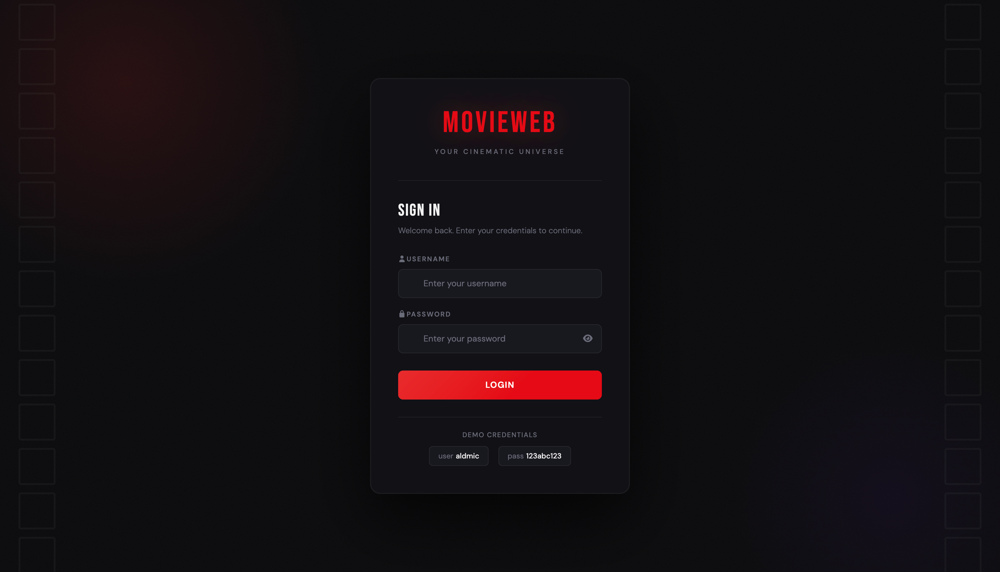
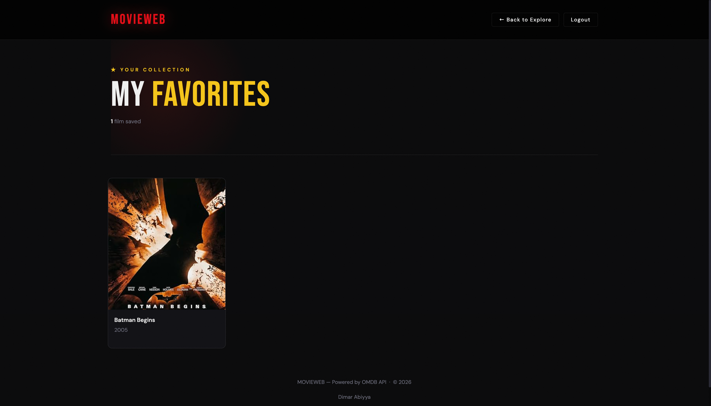
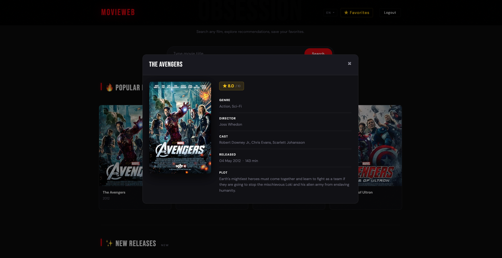

🎬 Movie Library App (OMDB API Integration)
Aplikasi berbasis web untuk mencari informasi film menggunakan OMDB API, dilengkapi dengan fitur manajemen bahasa (Localization) dan sistem otentikasi.

🛠 Libraries & Tech Stack
Aplikasi ini dibangun menggunakan ekosistem PHP dan JavaScript dengan pustaka-pustaka berikut:

Backend (Framework)
Laravel 5: Framework PHP utama untuk logika bisnis dan routing.

GuzzleHTTP: Digunakan untuk melakukan request API ke OMDB.

Laravel Session: Untuk mengelola preferensi bahasa (Localization).

Frontend
Bootstrap 4: Framework CSS untuk tampilan yang responsif.

JQuery: Untuk manipulasi DOM dan fitur interaktif (seperti show/hide password).

FontAwesome 4.7: Library ikon untuk antarmuka pengguna.

Google Fonts: Menggunakan font Nunito untuk tipografi yang bersih.

Database
MySQL/MariaDB: Untuk menyimpan data pengguna (User) dan daftar favorit.

🏗 Architecture
Proyek ini mengikuti arsitektur MVC (Model-View-Controller) yang merupakan standar dari Laravel:

Models: Mengelola data dan interaksi database (terletak di app/).

Views: Template antarmuka menggunakan Blade Engine (terletak di resources/views/).

Controllers: Menangani logika permintaan pengguna dan menjembatani Model ke View (terletak di app/Http/Controllers/).

Fitur Utama:
Localization (Multi-language): Menggunakan Middleware SetLocale untuk beralih antara Bahasa Indonesia dan Inggris secara dinamis via Session.

External API Integration: Mengambil data film secara real-time dari server pihak ketiga.

Authentication: Sistem Login dan Register yang aman.

📸 Screenshots
Berikut adalah tampilan dari aplikasi yang dikerjakan:

1. Home / Search Page
Halaman utama untuk mencari film dan memilih bahasa (EN/ID).
!
*() *

2. Login Page
Halaman otentikasi dengan fitur toggle password (Show/Hide).
!
*() *

3. Favorites
Menampilkan Favorit list berdasarkan user.
!
*(S) *

4. Detail
Menampilkan informasi lengkap mengenai film yang dipilih.
!
*() *